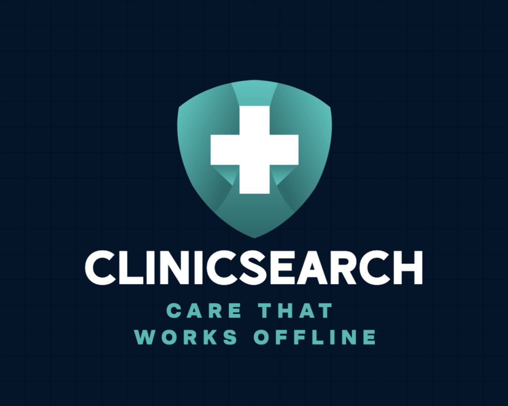

<p align="center">
  
</p>

<p align="center">
  <strong>Offline multilingual clinical knowledge for rural healthcare workers.</strong>
</p>

<p align="center">
  A retrieval-augmented generation system that lets a community health worker ask a clinical question — in English, Português, Swahili, हिन्दी, or Français — by voice or by text, and receive a cited answer from WHO clinical guidelines, MSF Clinical Guidelines, and OpenFDA drug data. Runs entirely offline on a laptop, with a phone connecting over local WiFi.
</p>

<p align="center">
  Built for the <a href="https://www.kaggle.com/competitions/gemma-4-good-hackathon">Gemma 4 Good Hackathon</a>.
</p>

---

## What it does

A doctor in a rural clinic with no internet opens ClinicSearch on her phone. She types a question in Swahili: *"Dawa ya kwanza ya malaria kwa watoto."* In about 30 seconds, she sees a cited answer drawn from the WHO Malaria Guidelines, with the exact source passage available on tap. At the clinic laptop, her colleague speaks a question in Hindi into the microphone — the system transcribes, retrieves, and answers with full citations.

The intelligence runs on a $400 laptop that sits in the clinic. The laptop and phone share a local WiFi network. **No data ever leaves the room.**

## Why Gemma 4 E2B

We chose **Gemma 4 E2B** — the edge-class model — because ClinicSearch is built for real rural clinic hardware, not for benchmark-chasing. A $400 laptop with 16 GB unified memory is the realistic deployment target. E2B fits entirely in GPU memory on that hardware and leaves headroom for EmbeddingGemma, ChromaDB, faster-whisper, and Streamlit to all coexist. This is the difference between an AI demo and a deployable system.

## Architecture

```
┌──────────────────────┐         WiFi          ┌─────────────────────────┐
│   Android Phone      │ ◄───────────────────► │   MacBook (clinic       │
│   (ClinicSearch APK) │   http://192.168...   │    gateway server)      │
│   = thin WebView     │                       │                         │
│                      │                       │  Streamlit (8501)       │
└──────────────────────┘                       │       │                 │
                                               │       ▼                 │
┌──────────────────────┐                       │  faster-whisper          │
│   Laptop Browser     │                       │  (voice at gateway)     │
│   localhost:8501     │                       │       │                 │
│   voice + text       │                       │       ▼                 │
└──────────────────────┘                       │  HyDE query expansion   │
                                               │       │                 │
                                               │       ▼                 │
                                               │  EmbeddingGemma 300M    │
                                               │       │                 │
                                               │       ▼                 │
                                               │  ChromaDB ← 77K chunks  │
                                               │  (stratified retrieval) │
                                               │       │                 │
                                               │       ▼                 │
                                               │  Gemma 4 E2B → Answer   │
                                               │   (via Ollama)          │
                                               └─────────────────────────┘
```

## Key Technical Features

- **Source-stratified retrieval**: Queries WHO, MSF, and OpenFDA pools separately to guarantee clinical guidelines are always represented despite the 900:1 corpus imbalance with OpenFDA
- **HyDE (Hypothetical Document Embeddings)**: Generates a brief hypothetical answer in English to use as the search vector, bridging the lexical gap between user questions and guideline prose. Always generates in English regardless of input language to match the English-language corpus
- **Strict refusal safety**: The system refuses to answer when retrieved sources don't contain relevant information, rather than hallucinating clinical guidance. This is the most important safety property of a clinical RAG system
- **Multilingual I/O**: Accepts questions in 5 languages, responds in the user's language, while internally searching an English corpus via English HyDE expansion

## Stack

| Layer | Technology | Why |
|---|---|---|
| LLM | **Gemma 4 E2B** via Ollama | Edge-class model, fits in 16 GB unified memory with headroom |
| Embeddings | **EmbeddingGemma 300M** via Ollama | 100+ languages, 768-dim, INT8 quantized |
| Vector DB | **ChromaDB** | Persistent, cosine similarity, ARM64-native |
| Voice | **faster-whisper** base | 4× real-time on M2 CPU, robust on low-resource languages |
| Web UI | **Streamlit** | Fast iteration, mobile-friendly |
| APK | **WebView wrapper** | No Android Studio required, cleartext-allowed for LAN |

## Data Sources

| Source | Type | Chunks | Coverage |
|---|---|---|---|
| WHO Malaria Guidelines (2023) | Clinical protocol | ~1,147 | Malaria treatment, prevention, diagnosis |
| WHO TB Guidelines (2022) | Clinical protocol | ~111 | Drug-susceptible TB treatment |
| WHO Antenatal Care (2016) | Clinical protocol | ~381 | Pregnancy care, iron/folic acid, preeclampsia |
| WHO Essential Medicines List (2023) | Drug formulary | ~83 | Drug names, formulations, categories |
| MSF Clinical Guidelines | Clinical protocol | ~423 | TB, HIV, malnutrition, emergencies, sepsis |
| OpenFDA Drug Interactions | Drug safety | ~74,701 | Drug interactions, contraindications, adverse events |

**Total: ~76,846 chunks indexed**

## Quick start

### 1. Setup

```bash
git clone <this-repo> clinicsearch
cd clinicsearch
bash setup.sh
```

This installs Homebrew (if missing), pyenv + Python 3.12.8, Ollama, both models, and all Python dependencies. Allow 30–60 minutes total (model downloads dominate).

### 2. Download data

```bash
source .venv/bin/activate
python scripts/download_data.py
```

This downloads OpenFDA automatically and prints instructions for the PDF sources to download manually.

### 3. Build the index

```bash
python -m src.ingest   # ~2 minutes
python -m src.embed    # ~10-15 minutes on M2
```

### 4. Run the app

```bash
streamlit run app.py \
    --server.address=0.0.0.0 \
    --server.port=8501 \
    --server.headless=true \
    --browser.gatherUsageStats=false
```

Open `http://<your-laptop-ip>:8501` from any device on the same WiFi.

Find your laptop's IP with `ipconfig getifaddr en0`.

### 5. Build the APK (optional)

```bash
# 1. Find your laptop's WiFi IP
ipconfig getifaddr en0

# 2. Edit apk_wrapper/webapk.conf and replace YOUR_LAPTOP_IP

# 3. Build
bash apk_wrapper/build_apk.sh

# 4. The APK appears at apk_wrapper/clinicsearch.apk
# Transfer to phone, enable "Install unknown apps", tap to install
```

## Evaluation

```bash
python scripts/run_evaluation.py
```

Runs 48 queries across 5 languages and 6 clinical domains. Computes precision@1/3/5, refusal accuracy, and latency distribution. Output: `eval/eval_results.json`.

## Project layout

```
clinicsearch/
├── app.py                          # Streamlit UI entry point
├── setup.sh                        # One-shot environment setup
├── requirements.txt                # Pinned Python dependencies
├── .env.example                    # Configuration template
├── src/
│   ├── __init__.py
│   ├── config.py                   # Centralized settings
│   ├── ingest.py                   # PDF/JSON → chunks
│   ├── embed.py                    # Chunks → ChromaDB
│   ├── rag.py                      # Retrieve + generate (core module)
│   └── voice.py                    # Whisper transcription
├── scripts/
│   ├── verify_environment.py       # Pre-flight smoke test
│   ├── download_data.py            # Fetch corpus sources
│   ├── build_chunks.py             # CLI wrapper for src.ingest
│   ├── build_index.py              # CLI wrapper for src.embed
│   ├── ask_question.py             # CLI question interface
│   └── run_evaluation.py           # Evaluation harness
├── eval/
│   ├── test_queries.json           # 48 evaluation queries
│   └── eval_results.json           # Populated by run_evaluation.py
├── apk_wrapper/
│   ├── webapk.conf                 # APK build configuration
│   ├── build_apk.sh                # APK build script
│   └── icon.png                    # App icon (auto-generated if missing)
└── data/
    └── raw/                        # downloaded source documents
                                    # note: chunks/ and chroma_db/ are
                                    # generated locally by ingest/embed
                                    # and are not committed to git
```

## Configuration

Edit `.env` (copy from `.env.example`) to override defaults:

```bash
GEMMA_MODEL=gemma4:e2b
EMBED_MODEL=embeddinggemma:300m-qat-q8_0
WHISPER_MODEL=base               # tiny/base/small (base recommended)
CHUNK_SIZE_WORDS=300
TOP_K_RETRIEVAL=5
```

## Performance

On a 16 GB MacBook M2:

| Operation | Time |
|---|---|
| HyDE expansion | ~2–4 s |
| Query embedding | ~30 ms |
| ChromaDB retrieval (77K chunks, stratified) | ~50–100 ms |
| Gemma 4 E2B generation (150 tokens) | ~15–25 s |
| **End-to-end RAG query** | **~20–35 s** |
| Voice transcription (5s audio) | ~1–2 s |
| Full corpus embedding (77K chunks) | ~15 min one-time |

RAM usage with everything loaded: ~10–12 GB.

## Limitations

- **Clinical safety**: ClinicSearch is a decision-support tool, not a substitute for clinical judgment. It cannot diagnose, does not cover every condition, and correctly refuses when sources lack relevant information
- **Voice input on mobile**: Due to browser secure-context constraints, voice input works at the clinic gateway (laptop browser via localhost) but not on mobile clients over plain HTTP. Mobile clients support text input only
- **Multilingual retrieval**: Retrieval precision is higher for English queries because the corpus is English-language. Non-English queries are expanded to English via HyDE, but some precision loss is expected for low-resource languages
- **Latency**: Running on a 16 GB MacBook with partial CPU/GPU split, end-to-end latency is 20–35 seconds. On hardware with more GPU memory, this would decrease significantly

## License

Apache 2.0. WHO, MSF, and OpenFDA data remain under their respective licenses.
